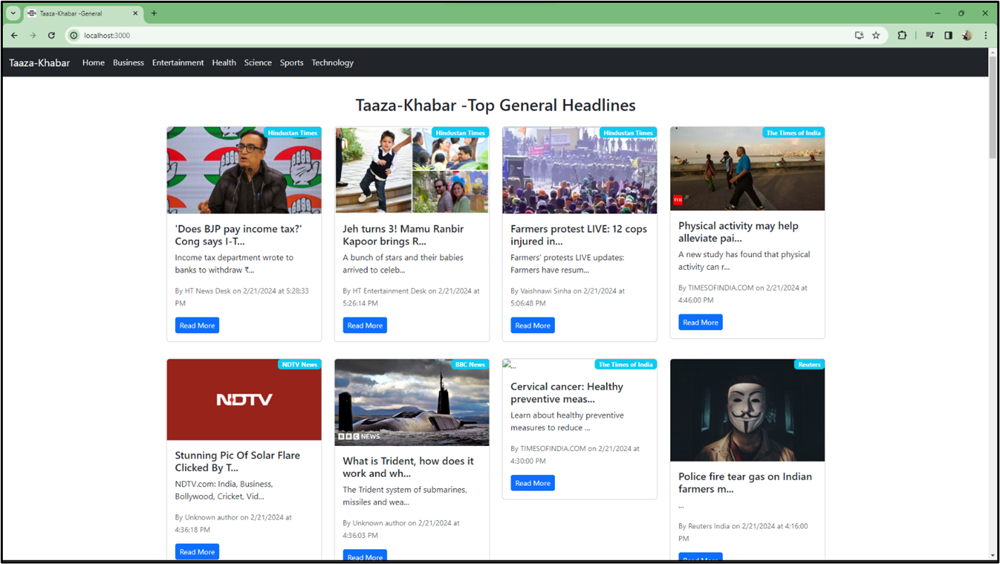
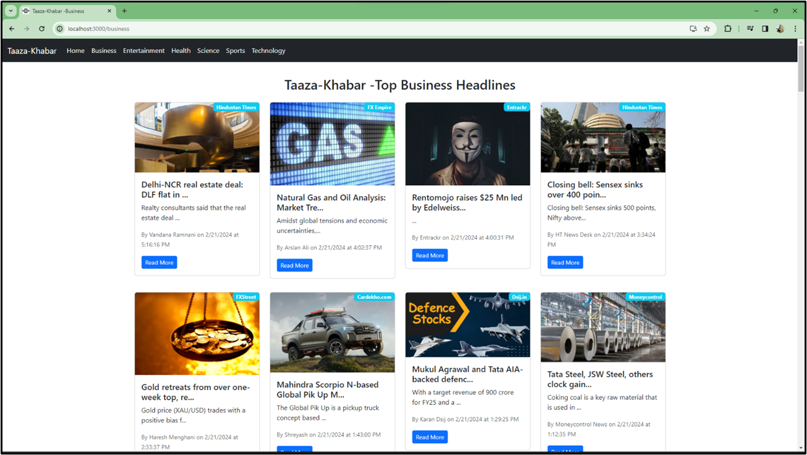
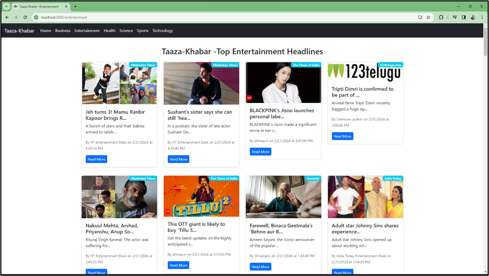

<h1>Taaza-Khabar</h1>
Taaza Khabar is a sophisticated React application designed to provide users with a unique news browsing experience. Utilizing the newsapi.org API, the app offers a curated selection of news articles from a day older, presenting users with a comprehensive overview of recent events. Allowing users to navigate through different news categories with ease. From business to sports, technology, and more, Taaza Khabar categorizes news articles to cater to a wide range of interests. This categorization feature enables users to quickly access news that is relevant to them, enhancing their overall browsing experience. One of the standout features of Taaza Khabar is its login functionality, which provides users with personalized access to news articles. Logged-in users can not only view news from various categories but also bookmark articles for later reading. This personalized approach enhances user engagement and encourages users to return to the app for their news needs. In addition to its user-friendly interface and personalized features.

<h1>Features</h1>

<ol>
<li>User Registration and Login: Users can create accounts and log in to access personalized features and content.</li>
<li>News Categories: The app offers a variety of news categories such as business, science, entertainment, and more, allowing users to explore news topics of interest.
</li>
<li>
Bookmarking: Users can bookmark articles to save them for later reading, making it easy to keep track of important or interesting news stories.
</li>

<li>
Personalized News Feed: Logged-in users receive a personalized news feed based on their interests and browsing history, ensuring they receive relevant content.

</li>

<li>
Source Attribution: Each article includes information about the source, date, author name, and a brief description, providing users with context and credibility
</li>

<li>Read More: Users can click on a "Read More" button to access the full article, allowing them to delve deeper into topics of interest.
</li>
</ol>

<h1>Prerequistites</h1>

<ol>
<li>react-router-dom</li>
<li>concurrently</li>
<li>nodemon</li>
<li>bcryptjs</li>
<li>express-validator</li>
<li>jsonwebtoken</li>
<li>mongoose</li>
</ol>

<h1>Steps to install</h1>

<ol>
<li>To run the project, you'll need to have Node.js installed on your machine.</li>
<li>Download Project Source Code from here.o execute the code, run the command npm run both in the terminal.</li>
<li>o execute the code, run the command npm run both in the terminal.</li>
</ol>

